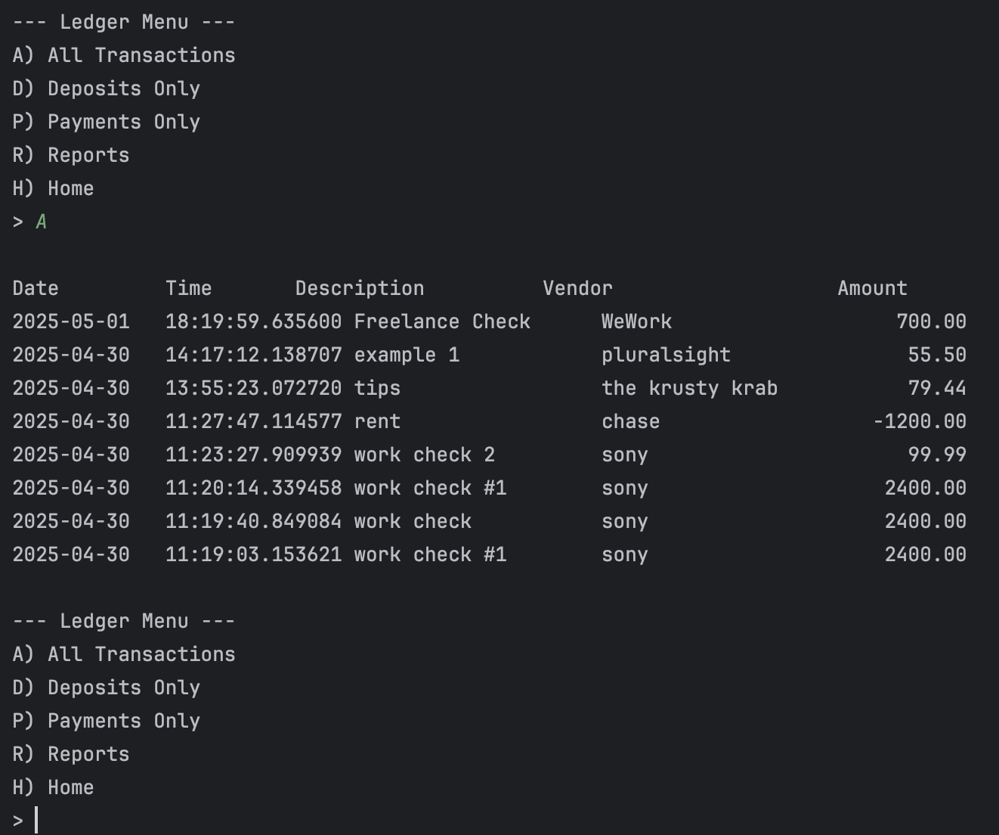
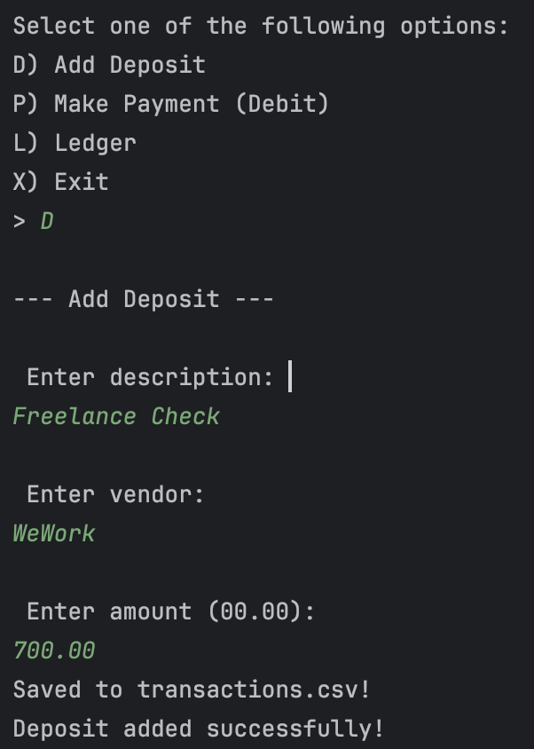

# 🧾 Accounting Ledger CLI App

This is a Java-based command-line application that functions as a personal or small business accounting ledger. It allows users to track deposits and payments, view transaction history, generate financial reports, and persist data in a CSV file.

---

## 📦 Features

- Add deposits or payments
- View all transactions, deposits only, or payments only
- Generate reports:
    - Month to Date
    - Previous Month
    - Year to Date
    - Previous Year
    - Filter by Vendor
- Data is saved to and loaded from `transactions.csv`
- Console menu interface using Java's `Scanner`

---

## 🛠️ How It Works

1. On startup, the app loads previous transactions from `transactions.csv` (if it exists).
2. Users can add a new deposit or payment by providing:
    - Description
    - Vendor
    - Amount
3. All transactions are stored as objects and saved to the file.
4. Users can view and filter transactions via the **Ledger** and **Reports** screens.

---

## 👨‍💻 Technologies Used

- Java 17+
- Console I/O (`Scanner`)
- File I/O (`BufferedReader`, `BufferedWriter`)
- Object-Oriented Programming
- Collections (`ArrayList`)
- Java 8 Date/Time API (`LocalDate`, `LocalDateTime`, `LocalTime`)

---

## 🧠 Java Concepts Practiced

| Concept | Description |
|--------|-------------|
| Classes & Objects | `Transaction`, `Ledger` classes manage data |
| Methods | Modular screen functions like `addDepositScreen()` |
| Arrays & Lists | `ArrayList<Transaction>` stores all transactions |
| File Input/Output | Reads/writes data to a persistent CSV file |
| Loops & Conditionals | Menus and filtering logic |
| Date Handling | Used for generating dynamic reports |
| String Manipulation | Used for vendor search and formatting |
| Encapsulation | Getters/setters used for transaction attributes |

---

## 📈 Screenshots

### 🧾 Sample Interaction – Adding a Deposit

### 🧾 Sample Interaction – Ledger Menu

---

## 🧑‍🏫 Educational Use

This project was completed as part of a Java fundamentals program.  
It applies lessons from foundational Java workbooks covering:

- Input/output
- Static methods
- String handling
- OOP design
- Collections
- Exception handling
- File reading/writing
- Date/time operations

---

## 👨‍💻 Author

Jesse Hernandez
Capstone Project — Java CLI Ledger App  
YearUp United 
